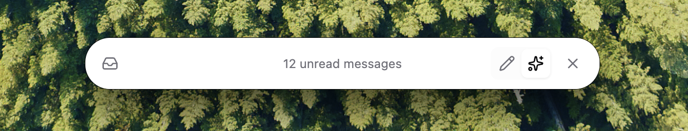
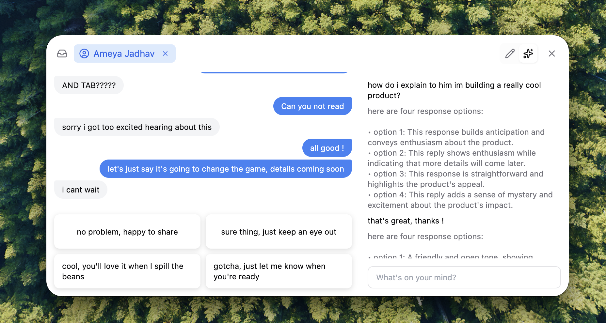
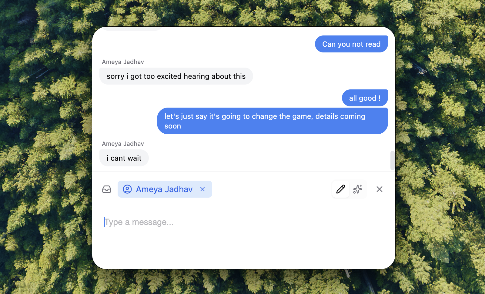

# Textreme

AI-powered iMessage response generation using fine-tuned models and agentic workflows.

## Video Demo 

[Demo Video](apps/overlay/src/assets/finaldemo.mp4)
Link: https://screen.studio/share/72wVyGXE?state=uploading

### Product

Startup Page


Inbox View


Tab Mode


Agent Mode


### Keyboard Shortcuts

- **`Cmd + I`** - Navigate from start page to unread messages inbox view
- **`Enter`** - Select a conversation and enter tab mode
- **`Cmd + P`** - Switch between tab and agent modes
- **`Esc`** - Return to start page from tab or agent mode

## Project Structure

`pnpm=9.15.4` other versions might not work

```
textreme/
├── apps/
│   └── overlay/          # electron overlay app
├── ml/
│   ├── data/             # iMessage extraction scripts
│   └── training/         # LLaMA 3.1 8B fine-tuning (Modal + Axolotl)
├── packages/
│   ├── client/           # shared client library
│   └── schema/           # shared type definitions
└── notes/                # development notes
```

## Quick Start

### 1. Overlay App

#### Allow Access to iMessage Database

- Open System Settings
- Open Privacy & Security -> Full Disk Access
- Allow for whichever app in which you run `pnpm dev` (typically your IDE or terminal)

#### Install & Run

```bash
# install dependencies
pnpm install

# run the overlay app
pnpm dev

# get contacts info to the app (compile Swift binary for your macOS version)
cd apps/overlay && swiftc -o contacts_dump contacts_dump.swift
```

### 2. ML Training Pipeline

Fine-tune LLaMA 3.1 8B on your text messages to predict responses.

#### Quick Start

```bash
cd ml

# 1. Install: uv sync && uv run modal setup
# 2. Set up Modal secrets (HuggingFace + W&B)
# 3. Prepare data: cd data && uv run python prepare_data.py
# 4. Train: uv run modal run -m ml.training.train --data=data/training_data.jsonl
```

See [`ml/README.md`](ml/README.md) for the complete guide.

## Development

### Extract iMessages

```bash
cd ml/data
python extract_recent_messages.py
```

This extracts your recent conversations to `ml/data/recent_conversations/`.

### Train a Model

```bash
cd ml

# prepare training data (convert conversations to JSONL)
cd data && uv run python prepare_data.py && cd ..

# start training on Modal
uv run modal run -m ml.training.train --data=data/training_data.jsonl
```

Monitor training at https://wandb.ai/

## Documentation

- **ML Training**: [`ml/README.md`](ml/README.md) - Training setup and usage
- **Data Extraction**: [`ml/data/README.md`](ml/data/README.md) - iMessage extraction guide
- **Notes**: [`notes/`](notes/) - Development notes and explorations
